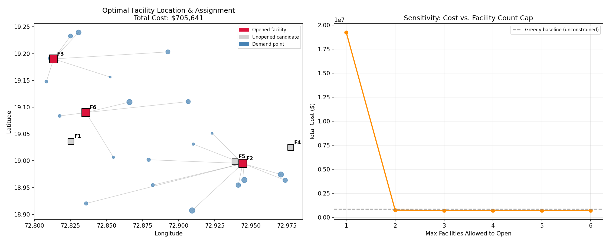

# Capacitated Facility Location Optimization (MILP)

A Mixed-Integer Linear Programming (MILP) model for optimal facility siting — applied here to substation/distribution-center placement over a synthetic demand network — solved using PuLP with the CBC solver.



## Problem Statement

Given a set of demand points (load centers) and a set of candidate facility sites, decide **which facilities to open** and **which demand points each open facility should serve**, in order to minimize total cost — the sum of fixed facility-opening costs and variable transportation/service costs — subject to facility capacity limits.

This is the classical **Capacitated Facility Location Problem (CFLP)**.

## Mathematical Formulation

**Sets**
- `I` — demand points (indexed `i`)
- `J` — candidate facility sites (indexed `j`)

**Parameters**
- `f_j` — fixed cost of opening facility `j`
- `c_ij` — unit cost of serving demand point `i` from facility `j`
- `d_i` — demand at point `i`
- `s_j` — capacity of facility `j`

**Decision Variables**
- `y_j ∈ {0,1}` — 1 if facility `j` is opened
- `x_ij ∈ [0,1]` — fraction of demand `i` served by facility `j`

**Objective**

```
min  Σ_j f_j · y_j  +  Σ_i Σ_j c_ij · d_i · x_ij
```

**Constraints**

```
Σ_j x_ij = 1                        ∀ i        (each demand point fully served)
Σ_i d_i · x_ij ≤ s_j · y_j          ∀ j        (capacity, linked to open/close decision)
x_ij ≤ y_j                          ∀ i, j     (no assignment to a closed facility)
y_j ∈ {0,1},  x_ij ≥ 0
```

## Approach

1. **Data generation** — 20 synthetic demand points and 6 candidate facility sites scattered over a real geographic bounding box (Mumbai), with randomized demand loads, facility capacities, and fixed opening costs. Distances computed via the haversine formula.
2. **MILP solve** — formulated and solved with PuLP (CBC solver).
3. **Baseline comparison** — a greedy nearest-facility heuristic (capacity-aware, largest-demand-first) implemented for comparison against the MILP optimum.
4. **Sensitivity analysis** — total cost re-solved under a cap on the maximum number of facilities allowed to open (1 through 6), to show the cost/facility-count trade-off.
5. **Visualization** — map of demand points, opened vs. unopened facilities, and assignment links; sensitivity curve of cost vs. facility count cap.

## Results

| Metric | Value |
|---|---|
| MILP Optimal Cost | $705,641 |
| Greedy Baseline Cost | $860,546 |
| **Cost Savings (MILP vs. Greedy)** | **18.0%** |
| Facilities Opened (MILP) | F2, F3, F6 |
| Facilities Opened (Greedy) | F1, F2, F3, F5, F6 |
| Demand Points | 20 |
| Candidate Facilities | 6 |

The sensitivity analysis shows the problem is **infeasible with only 1 facility open** (insufficient combined capacity), cost drops sharply from 2 to 3 open facilities, and flattens beyond 3 — indicating 3 facilities is the cost-optimal count for this network.

## How to Run

```bash
pip install pulp numpy pandas matplotlib
python facility_location.py
```

Outputs generated:
- `facility_location_results.png` — map + sensitivity plot
- `results_summary.csv` — headline metrics
- `sensitivity_analysis.csv` — cost vs. facility-count-cap data

## Tools

- **Python 3**
- **PuLP** (MILP modeling) + **CBC** (open-source MILP solver)
- **NumPy / Pandas** (data handling)
- **Matplotlib** (visualization)

## Possible Extensions

- Replace synthetic coordinates with real DISCOM/substation location data
- Add a quadratic (distance²) cost term to model line losses in a power-distribution context
- Multi-period version allowing facilities to open across a planning horizon
- Stochastic demand (chance-constrained or two-stage stochastic MILP)
